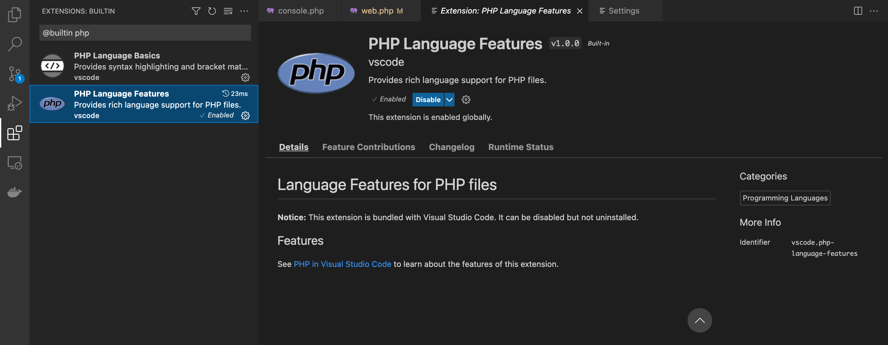
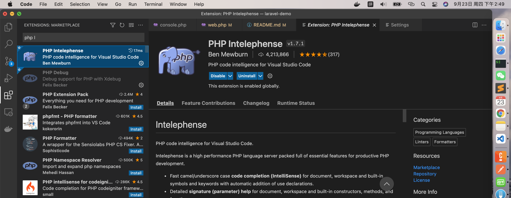
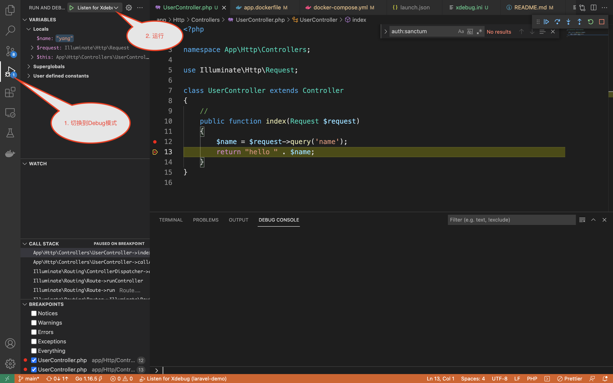

## php Laravel 环境搭建

### 开发工具

1. 下载安装 docker

2. 下载安装 vscode

    2.1 在扩展中搜索@builtin php, 选择 PHP Language Features，禁用此插件
    

    2.2 安装 PHP Intelephenese（此扩展提供高亮，联想，查找类/方法点击跳转，验证等功能） 安装完需要重启

    

### 开发环境

[dockerfile参考]: https://learnku.com/articles/24862

-   整个应用分为三个镜像，nginx， php-fpm， posgresql，所有配置文件到 docker 文件夹下面看就行了。

-   构建镜像命令 `docker build -t laravel-app:${tag} -f app.dockerfile .`

-   配置 xdebug（调试工具）（开发环境）

    1. 首先需要 php-fpm 中安装了 xdebug 扩展，此时在构建镜像是已经安装了，具体看`laravel-demo/docker/app.dockerfile`

    2. 配置 xdebug, 参考`laravel-demo/docker/php/xdebug.ini`

    3. 配置 vscode

        3.1 安装 PHP debug 扩展

        3.2 配置`.vscode/lanuch.json`

        ```json
        {
            // Use IntelliSense to learn about possible attributes.
            // Hover to view descriptions of existing attributes.
            // For more information, visit: https://go.microsoft.com/fwlink/?linkid=830387
            "version": "0.2.0",
            "configurations": [
                {
                    "name": "Listen for Xdebug",
                    "type": "php",
                    "request": "launch",
                    "port": 9003,
                    "pathMappings": {
                        // server -> local
                        "/var/www/": "${workspaceFolder}/"
                    }
                }
            ]
        }
        ```

#### 最后， 打开 Debug 模式，GOOD LUCK


